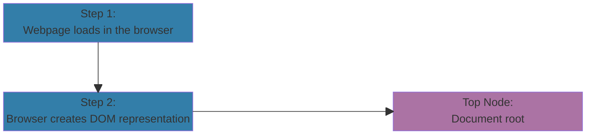
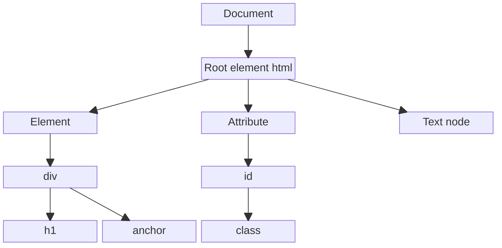

# Working With Dom

## Debugging in JavaScript

Common debugging techniques for JavaScript include:

- `console.log()`: prints values, variables or messages to the console.
- __breakpoint__: built-in developer tool, stops code execution to inspect code information
- `debugger`: Inserts directly into code to halt execution and trigger debugger
- __try-catch block__: quarantines code that may throw an error and provides instruction on how to proceed in that event
    ```javascript
    try {
        // code that may throw an error
    } catch (error) {
        // error handling code
    }
    ```
## Introduction To Document Object Model (DOM)

### What is DOM

<table>
<tr>
<td style="width:33%">

> ### Document
> - Web page or XML
> - Tree like hierarchy

</td>
<td style="width:33%">

> ### Object
> - Corresponding element, attribute, content
> - Accessible and manipulable using JavaScript

</td>
<td style="width:33%">

> ### Model
> - Structured and abstract representation of a web document

</td>
</tr>
</table>

### How Does The DOM Work



---

<table>
<tr>
<td style="width:420px">

```html
<!DOCTYPE HTML>
<html>
    <head>
        <title>Demo Example</title>
    </head>
    <body>
        <div>
            <h1>
                Heading Tag
            </h1>
            <a href="https://www.demo.com">
                Click Here
            </a>
        </div>
    </body>
</html>
```

</td>
<td style="width:100%">



</td>
</tr>
</table>

## $0 Variable

A special variable that can be used in the developer console to reference the currently selected element

## Accessing DOM Elements: Methods

- `getElementByID("id")`: returns an individual element; ids must be unique
- `getElementsByClassName("class name")`: returns an array of all elements in class
- `getElementsByTagName("tag")`: returns an array of all elements for given tag
- `querySelector("css style selector")`: returns the first element that matches a css selector
- `querySelectorAll("css style selector")`: returns an array with all elements that match a css selector

## Manipulating DOM Elements

### Changing Content

```javascript
const paragraph = document.getElementById("my-paragraph");
paragraph.textContent = "This is updated text.";
```

### Changing Attributes

```javascript
const image = document.getElementById("my-image");
image.setAttribute("src", "new-image.jpg");
```

### Adding And Removing Elements

```javascript
const list = document.getElementById("my-list");
const newItem = document.createElement("li");
newItem.textContent = "Item 3";
list.appendChild(newItem);
```

> [!IMPORTANT]
> See Also:
> - `replaceChild()`
> - `removeChild()`
> - `remove()`

### Handling Events

```javascript
const button = document.getElementById("my-button");
button.addEventListener("click", function() {
    alert("Button clicked!");
});
```

### Reordering Elements

```javascript
const container = document.getElementById("my-container");
const secondParagraph = document.querySelector("p:nth-child(2)");
container.insertBefore(secondParagraph, container.querySelector("p"));
```

### Cloning Elements

```javascript
const list = document.getElementById("my-list");
const firstItem = list.querySelector("li");
const clonedItem = firstItem.cloneNode(true);
list.appendChild(clonedItem);
```
