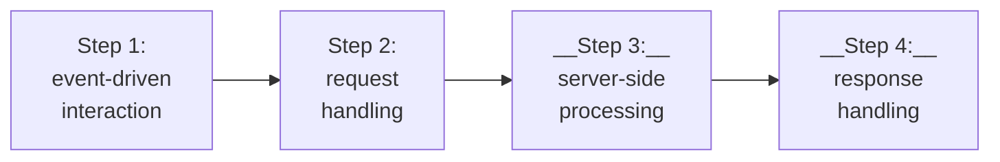

# JavaScript Async And HTTP Requests

## Intro To JSON

JSON, or JavaScript object notation is a lightweight data interchange format that is easy for
humans to read and write and easy for machines to parse and generate. It serves as a common language for data communication.

It uses a simple syntax with key value pairs and arrays, making it accessible to
developers and non developers alike.

JSON is simpler than other data interchange formats like XML. It doesn't have the complexity of tags and attributes,
making it less verbose and more concise.

JSON and objects in programming are related concepts, but they have some key differences:

<table>

<tr>
<th>
Aspect
</th>
<th>
JSON
</th>
<th>
Object
</th>
</tr>

<tr>
<td>
Text vs. data structures
</td>
<td>

- Text based data interchange format
- Represents data as a string
- Primarily used for data exchange or storage

</td>
<td>

- Fundamental data structure in programming
- Hold data and methods to manipulate it
- model entities or concepts in a software

</td>
</tr>

<tr>
<td>
Syntax
</td>
<td>

- Uses key-value pairs and is limited to predefined data types
- Keys are enclosed in double quotes

</td>
<td>

- Not restricted to a specific syntax or set of data types
- Can include a wide variety of data types

</td>
</tr>

<tr>
<td>
Purpose
</td>
<td>

- Used for data interchange
- Facilitate data transfer and interoperability
- Storing configuration data

</td>
<td>

- Model and manipulate data within the application
- Represent entities or concepts within the program's logic

</td>
</tr>

</table>

### JSON vs Object Example

<table>

<tr>
<th>
JSON (in JavaScript)
</th>
<th>
Object (in JavaScript)
</th>
</tr>


<tr>
<td>

```javascript
{
    "name": "John Doe",
    "age": 30,
    "city": "New York"
}
```

</td>
<td>

```javascript
const person = {
    name: "John Doe",
    age: 30,
    city: "New York"
    sayHello: function() {
        console.log("Hello, my name is " + this.name);
    }
};
```
</td>
</tr>
</table>

### JSON within JavaScript

#### Data in the JSON file books.json

```json
[
    {
        "title": "The Great Gatsby",
        "author": "F. Scott Fitzgerald",
        "publicationYear": 1925
    },
    {
        "title": "To Kill a Mockingbird",
        "author": "Harper Lee",
        "publicationYear": 1960
    },
    {
        "title": "1984",
        "author": "George Orwell",
        "publicationYear": 1949
    }
]
```

#### Example JavaScript to fetch JSON Data

``` javascript
// Function to fetch and work with JSON data
function fetchBooks() {
    // Fetch the JSON data from the file
    fetch("books.json")
        .then(response => response.json())  // dotThen
        .then(data => {
            // Data contains the JSON content
            console.log("List of Books:");
            data.forEach(book => {
                console.log(`Title: ${book.title}`);
                console.log(`Author: ${book.author}`);
                console.log(`Publication Year: ${book.publicationYear}`);
                console.log("------------------------");
            }); // forEach
        }) // dotThen
        .catch(error => {
            console.error("Error fetching JSON data:" , error);
        }); // dotCatch
}

// Call the function to fetch and work with JSON data
fetchBooks()
```
1) The fetch books function is defined. This function is responsible for
fetching and processing JSON data. Inside the fetch function, books.JSON is provided as
the URL to fetch JSON data from.

2) The fetch function returns a promise that resolves to the response object representing
the response to the request.

3) The dot then method is used to handle the response data when it becomes available.

4) It receives a callback function that parses the response as JSON data using response.JSON.

5) This function also returns a promise. Another dot then method is used to handle the parse JSON data.

6) Inside this callback function, the code iterates over each book in the JSON data using a for each loop. For each book, it logs the book's title, author, and publication year to the console.
After logging the information for each book, it adds a line of hyphens to separate the entries visually.

7) If an error occurs during the fetch operation or JSON parsing, the code uses dot catch to
handle and log the error to the console.

8) Finally, the fetch books function is called to initiate the data fetching and processing.

> [!NOTE]
> I do not think `promises` have been covered yet. Likely they are something to do with asynchronous processing and will be covered subsequently. However, if this is not the case I should ensure to research them independently.
>
> Likewise, I am still somewhat unclear on `callback functions` and should address this deficit also.

## Introduction To Async and Sync Execution

<table>

<tr>
<th>

### Synchronous Programming

</th>
<th>

### Asynchronous Programming

</th>
</tr>

<tr>
<td>

- Sequential code execution
- Waits for task completion
- can block program execution

</td>
<td>

- Executes code without blocking the execution thread
- Enables tasks to run concurrently
- Handles time-consuming tasks

</td>
</tr>

<tr>
<td>

#### Example

```javascript
console.log("Task 1");
console.log("Task 2");
console.log("Task 3");
```

- Task 1 will always happen first, before Task 2 and 3
- Task 2 will always happen after Task 1 but before Task 3
- Task 3 will always happen last, after Task 1 and 2

</td>
<td>

#### Example

```javascript

```

</td>
</tr>

</table>


### Asynchronous Programming: Key Concepts

<table>
<tr>
<td>

> :key: __Callback Functions:__
> - Functions passed as arguments
> - Executed after a certain delay
> - specifies execution tasks

</td>
<td>

> :key: __Promises:__
> - Objects that represents eventual completion
> - Provides a more clear and structured process </br> when compared to callbacks

</td>
</tr>
<tr>
<td>

> :key: __Async/Await:__
> - Introduced in ES2017
> - Allows writing code in synchronous style
> - Easier to read and write

</td>
<td>

> :key: __Event loop:__
> - Manages asynchronous operations
> - Continuously checks for tasks
> - Runs tasks in added order

</td>
</tr>
</table>

### Asynchronous Programming: Importance

Asynchronous programming is essential for web applications to remain responsive and handle multiple tasks simultaneously. For example, when a web page makes an HTTP request to fetch data from a server, it doesn't block the entire page while waiting for the response. Instead, the page can continue to respond to user interactions while waiting for the data.

Here's a basic example using the setTimeout function to illustrate asynchronous programming.

```javascript
console.log("Start");

setTimeout(function() {
    console.log("Delayed message");
}, 2000); // This code will execute after a 2 second delay

console.log("End");
```

The console output will be:

```console
Start
End
Delayed Message
```

'Start' and 'End' will be logged immediately, but 'Delayed message' will be logged after a two-second delay, because setTimeout is an asynchronous operation.

### Sync vs. Async Programming

| Feature | Synchronous | Asynchronous |
| :- | :- | :- |
| Order of execution | Code is executed in the order it appears, one step at a time, blocking the main thread | Code doesn't wait for a task to complete and can continue to execute other operations while asynchronous tasks are in progress |
| Blocking vs. Non-blocking | Blocks the program's execution while a task is in progress, potentially making it unresponsive | Doesn't block the program, it allows other tasks to run alongside the asynchronous one, improving responsiveness |
| Callbacks vs. Continuation | Relies on the natural order of code execution, where each line follows the previous one | Uses callbacks, promises, or async/await to manage and control the flow of asynchronous operations |
Use Cases | Suitable for simple scripts, mathematical calculations, or tasks that don't involve waiting for external resources | Ideal for handling I/O operations like network requests, file reading/writing, and tasks that require waiting for external events or user interactions

## Introduction To AJAX (Asynchronous JavaScript and XML)

AJAX, short for asynchronous JavaScript and XML, is a set of web development techniques used to
create dynamic and responsive web applications. It enables asynchronous communication
between the web browser and the server, allowing data to be exchanged without requiring a full page reload. This results in a more seamless and interactive user experience.

AJAX operates asynchronously, meaning it allows the webpage to send and receive data from the server in the background while the user interacts with the page.

### AJAX Components

- JavaScript is the primary language used to initiate AJAX requests and handle responses.

- XMLHttpRequest or XHR object is the core technology enabling communication between the browser and the server. It's used to send HTTP requests and handle responses.

- AJAX was initially associated with XML for data transfer, but later commonly uses JSON due to its simplicity and ease of parsing.

### How AJAX Works




Typically, an event like a button click triggers an AJAX request within a web page. JavaScript code initiates an XMLHttpRequest object, or uses modern fetch API to send an asynchronous request to the server. The server processes the request, performs necessary operations such as database queries, and generates a response. Upon receiving the response, JavaScript processes the data and updates specific parts of the web page, often without needing a full page reload.

### Advantages Of Using AJAX

- AJAX facilitates smooth and dynamic content updates, leading to a more interactive user interface.

- By updating only specific portions of the page, AJAX reduces bandwidth usage and
server load, enhancing performance.

- Users can continue interacting with the webpage while data is being fetched or processed in the background.

### AJAX Use Cases


### Common uses of AJAX

- You can use AJAX to load additional content on a page without reloading the entire page, as seen in infinite scrolling on social media platforms, live updates, and comments that load without page refreshes; all made possible through AJAX, enhancing the user experience.

- It enables sending form data to the server without refreshing the entire page powering dynamic product listings, filtering, and shopping cart updates, providing users with a seamless and efficient shopping experience.

- AJAX plays a vital role in enabling realtime updates. Features like live chat or stock market information can be delivered without interrupting user activity. Collaborative platforms like Google Docs or Trello leverage AJAX this feature for  collaborative editing, seamlessly enhancing workflow without disruption.

- Automatically saving feature saves user input without requiring manual submissions.

### AJAX Best Practices

- Robust error handling mechanisms are essential to manage failed requests or timeouts. Implementing retries or fallback strategies ensures a smoother user experience.

- Cross-site scripting, XSS, and other security vulnerabilities should be considered when implementing AJAX. Implementing proper authentication and encryption measures is crucial.

- Understanding and addressing cross-origin restrictions by using cores, cross-origin resource sharing headers, when making requests to different domains.

### AJAX In Modern Development

Many modern frameworks such as React, Angular, and Vue.js, offer built in functionalities that utilize AJAX principles for efficient data handling and rendering.

The fetch API introduced in modern browsers provides a more streamlined and promise-based approach to making HTTP requests, offering an alternative to XMLHttpRequest.

## HTTP Requests With XMLHttpRequest (XHR)

XMLHttpRequest (XHR) is a JavaScript API that enables communication between a web browser and a server. It allows for making HTTP requests to retrieve data from a server or
send data to a server in the background without reloading the entire web page.

XMLHttpRequest is at the core of AJAX, asynchronous JavaScript and XML, a technique for creating
more responsive and dynamic web applications.

### Features And Functionalities

- __XMLHttpRequest object creation:__

- __GET request handling:__ use XMLHttpRequest to fetch data from
external APIs or servers managing different data formats such as JSON or XML.

- __Response Management:__ utilize event listeners to handle responses,
including response codes like success or failure. Additionally, you can dynamically update web page content based on the received data.

- __effectively manage errors and timeouts:__

- __Use XMLHttpRequest to retrieve data securely:__  addressing concerns such as cross-origin request.

### AJAX example using XMLHttpRequest

The following example uses XMLHttpRequest to update the user information without reloading the entire page.

```html
<!DOCTYPE html>
<html>
<head>
    <title>AJAX Example</title>
</head>
<body>
    <button id="loadUserBtn">Load Users</button>
    <div id="userList"></div>

    <script>
        document.getElementById("loadUsersBtn").addEventListener("click", function() {
            /* == AJAX functionality == */
            // create an XMLHttpRequest object
            var xhr = new XMLHttpRequest()
            // execute get request
            xhr.open("GET", "https://jsonplaceholder.typicode.com/users", true);
            // manage response
            xhr.onload = function() {
                if (xhr.status >= 200 && xhr.status < 400>) {
                    var users = JSON.parse(xhr.responseText);
                    displayUsers(users);
                } else {
                    console.error("Error fetching data");
                }
            };
            // error handling
            xhr.onerror = function (0) {
                console.error("Network error");
            };
            // send request
            xhr.send();

            // Function to display users on the page
            function displayUsers(users) {
                var userListDiv = document.getElementById("userList");
                userListDiv.innerHTML = "<h2>User List</h2>";
                var ul = document.createElement("ul");

                users.forEach(function(user) {
                    var li = document.createElement("li");
                    li.textContent = user.name;
                    ul.appendChild(li);
                });
                userListDiv.appendChild(ul);
            }
        });
    </script>
</body>
</html>
```
